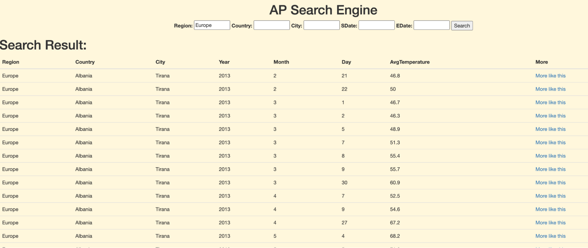

# AccuWeather Search Engine Improvement ☔️

  

## Overview
Weather search engine like AccuWeather can only support search temperature of a specific city and the weather is always the newest. However, what if people want to know the previous weather? or, what if we just want to have a general idea of what's the average temperature like in Africa? 

Compared with traditional weather search engine, I developed a new weather search engine that we can either **get the temperature results based on the dates or region**. The results rank is based on date. At the same time, we can do a further search based on the search results with **[more like this]** to get more related results.

## Search example

* We can search the average temperature of Algiers at 01/01/1995

* We can just check the Europe average temperature.
  

* We can click on **more like this** to get more related temperature records.
  

